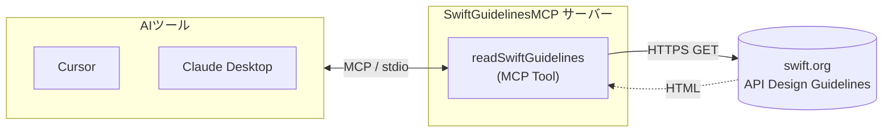

# Swift Guidelines MCP Server

[](https://github.com/kokiTakashiki/SwiftGuidelinesMCP/actions/workflows/build.yml)

Swift API Design Guidelinesを読み込めるMCP (Model Context Protocol) サーバーです。swift.orgからリアルタイムにガイドラインを取得できます。

## 機能

- **readSwiftGuidelines**: Swift API Design Guidelinesをswift.orgから読み込みます
  - オプションで特定のセクション（例: "Naming", "Clarity"）を指定して取得できます
  - セクション指定がない場合は、ガイドライン全体を返します
  - 指定したセクションが見つからなかった場合は、本文冒頭のプレビューをフォールバックとして返します

## 必要な環境

- macOS 13.0 以降 または Linux（Ubuntu 22.04 で動作確認）
- Swift 6.2 以降（macOS の場合は Xcode 26 以降）

## セットアップ

開発ツール（SwiftFormat / swiftly + 最新 Swift ツールチェーン）をインストールします。

```bash
make setup
```

`.swift-version` で使用する Swift バージョン（現在 `6.3.1`）を固定しています。swiftly がこのファイルを読み取り、対応するツールチェーンを自動選択します。

## ビルド方法

```bash
make build
```

実行ファイルは `.build/release/SwiftGuidelinesMCP` に生成されます。

## 使用方法

### Cursor / Claude Desktop での設定

1. Cursor または Claude Desktop の MCP 設定に以下を追記します（`command` はビルドした実行ファイルの絶対パス）:

```json
{
  "mcpServers": {
    "swift-api-guidelines": {
      "command": "/path/to/SwiftGuidelinesMCP/.build/release/SwiftGuidelinesMCP"
    }
  }
}
```

2. Cursor / Claude Desktop を再起動します

### 使用例

Cursorのチャットで、`@swift-guidelines` または `@swift-api-guidelines` を指定して使用できます：

```
@swift-guidelines Swiftメソッド命名のベストプラクティスは？
```

または、特定のセクションを指定：

```
@swift-guidelines Namingセクションの内容を教えてください
```

## 技術スタック

- **言語**: Swift 6.2+（ローカルでは swiftly により 6.3.1 を使用）
- **フレームワーク**: [MCP Swift SDK](https://github.com/modelcontextprotocol/swift-sdk)
- **通信方式**: stdio (標準入出力)

## プロジェクト構造

```
SwiftGuidelinesMCP/
├── Package.swift          # Swift Package Managerの設定
├── Makefile               # setup / build / format など
├── .swift-format          # swift-format / SwiftFormat の設定
└── Sources/
    └── SwiftGuidelinesMCP/
        ├── Main.swift          # エントリポイント (@main)
        ├── Tool/               # MCP 境界層 (引数検証・結果詰め替え)
        ├── Domain/             # ドメイン型 (FetchScope / SectionName など)
        ├── Fetching/           # HTML 取得 (GuidelinesFetcher)
        ├── Parsing/            # HTML → プレーンテキスト → セクション抽出
        ├── Presentation/       # 提示メッセージ整形 (ロケール依存文言を集約)
        └── Errors/             # GuidelinesError
```

## アーキテクチャ

AIツールは MCP プロトコル（stdio 経由）で本サーバーに接続し、公開ツール `readSwiftGuidelines` を呼び出します。サーバーはリクエストを受けるたびに swift.org から HTML を取得し、必要に応じて指定セクションを抽出してプレーンテキストで返します。



設計のポイント:

- **インターフェース**: 公開するのは `readSwiftGuidelines` ツール 1 つ。`section` 引数の有無で全文取得とセクション抽出を切り替えます。
- **取得元**: 実行時に毎回 swift.org から取得し、リポジトリにはガイドライン本文を同梱しません。
- **内部の層分け**: Tool 境界の内側は `Fetching`（HTML 取得）/ `Parsing`（プレーン化・セクション抽出）/ `Presentation`（提示文整形）に分離し、層をまたぐたびに型が変わることで不正な合成をコンパイル時に弾きます。

## 依存関係の更新

依存関係のアップデート検知には [Renovate](https://docs.renovatebot.com/) を利用しています。設定は [renovate.json](./renovate.json) を参照してください。

対象:

- Swift Package Manager (`Package.swift`)
- GitHub Actions (`.github/workflows/*.yml`) — Docker イメージ (`swift:6.2-jammy` 等) を含む

有効化するには、GitHub 上でリポジトリに [Renovate GitHub App](https://github.com/apps/renovate) をインストールしてください。

## ライセンス

- 本ソフトウェア（ソースコード）は [MIT License](./LICENSE) の下で提供されます。
- 本ツールが実行時に取得する **Swift API Design Guidelines の内容** は [Swift.org](https://swift.org/) が公開する著作物であり、[Apache License 2.0](https://www.apache.org/licenses/LICENSE-2.0) に従います。
- **本リポジトリにはガイドライン本文を同梱していません**。各ユーザーの実行環境で都度 `https://swift.org/documentation/api-design-guidelines/` から取得する設計です。

## 商標・免責

- 「Swift」および Swift のロゴは Apple Inc. の商標です。
- 本プロジェクトは Apple Inc. および Swift.org とは無関係の非公式ツールです。公式に承認・後援されているものではありません。

## 開発

### 依存関係

- `modelcontextprotocol/swift-sdk`: MCPプロトコルの実装

## トラブルシューティング

### サーバーがすぐに終了する

サーバーが正常に起動しない場合は、ビルドが正しく行われているか確認してください：

```bash
make build
```

### ガイドラインが取得できない

ネットワーク接続を確認してください。サーバーは `https://swift.org/documentation/api-design-guidelines/` からコンテンツを取得します。

## 謝辞

- [Model Context Protocol](https://modelcontextprotocol.io/) の開発者コミュニティ
- [Swift.org](https://swift.org/) のSwift API Design Guidelines

